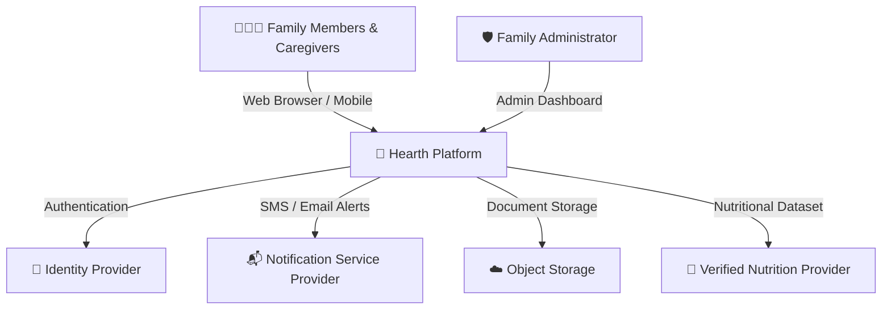
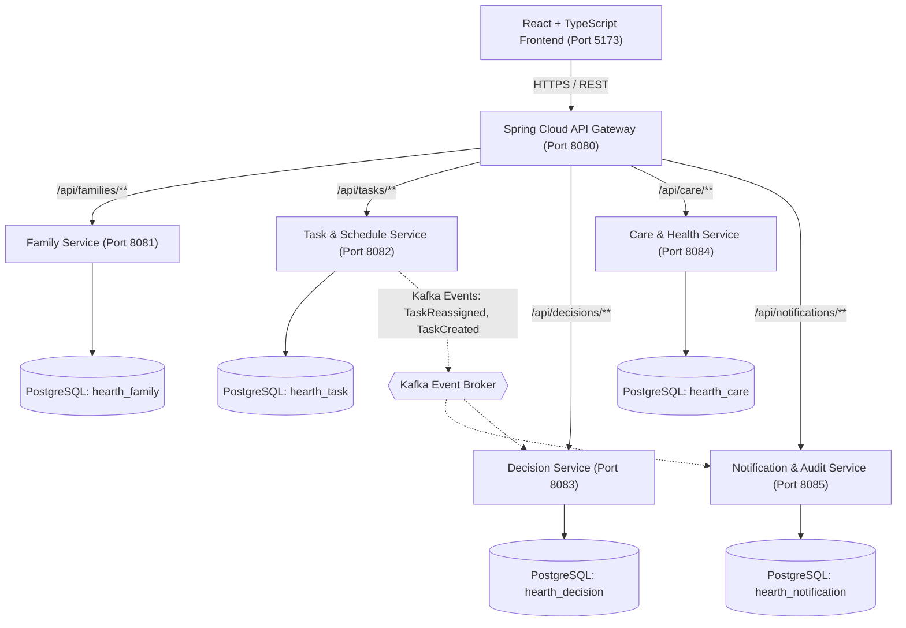
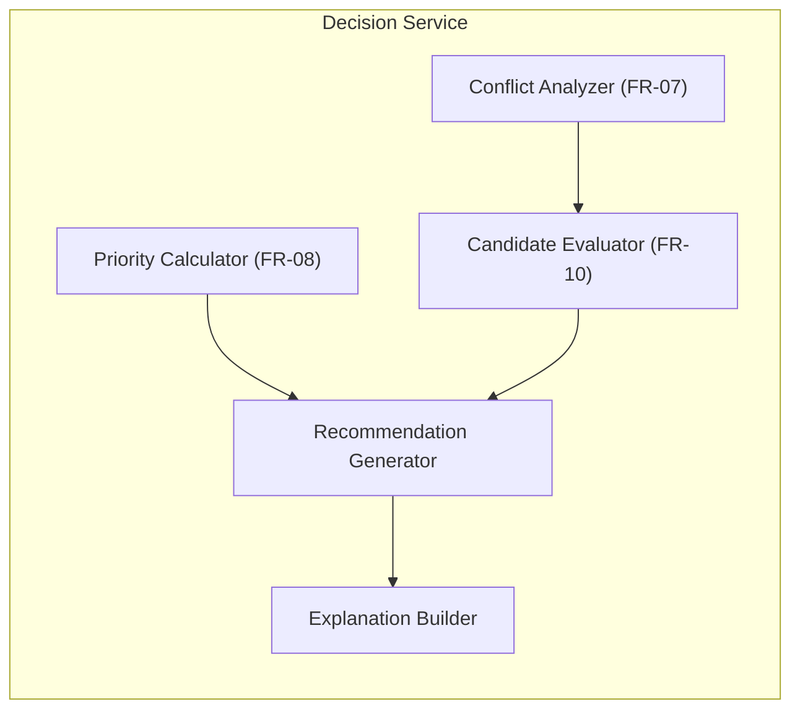
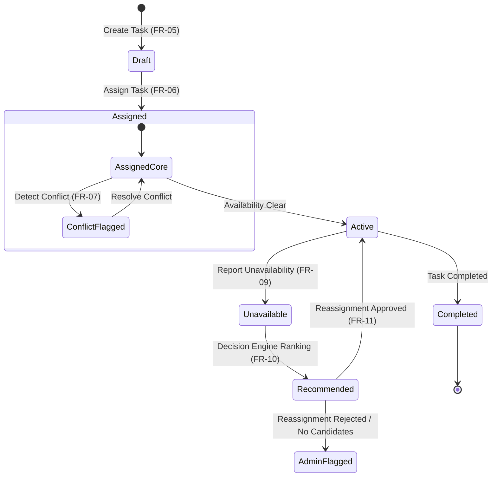

# Hearth Architecture & Design Diagrams (Mermaid)

## 1. System Context Diagram (Level 1)

## 2. Container Architecture (Level 2)

## 3. Decision Service Internal Components (Level 3)

## 4. Task State Machine Diagram

